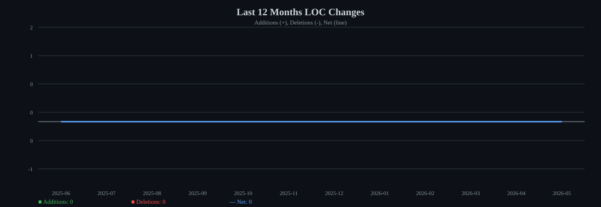
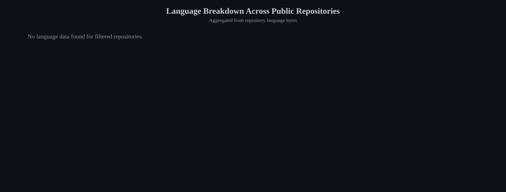

---

## Now

### Actively Working On

- **[obsidian-cli-query](https://github.com/jingyi-zhao-01/obsidian-cli)** — CLI tool for Obsidian queries  
  
  

- **[leetcode nvim](https://github.com/jingyi-zhao-01/leetcode.nvim)** - a forked version of leetcode.nvim adding external integration capabilities

- **[sys-design](https://github.com/jingyi-zhao-01/sys-design)** — System design resources  
- **[strategy-tester](https://github.com/jingyi-zhao-01/strategy-tester)** — Strategy testing framework

---

### Actively Monitoring

**Favorite**
- **[OpenHands](https://github.com/jingyi-zhao-01/OpenHands)** — Coding agent from the author of **[CodeAct](https://github.com/xingyaoww/code-act)**
- **[LlamaIndex](https://github.com/run-llama/llama_index)** — Federated Q/A over structured + unstructured data
- **[OpenClaw](https://github.com/jingyi-zhao-01/openclaw)**
- **[ObsidianACP](https://github.com/jingyi-zhao-01/obsidian-agent-client)** — ACP solution for Obsidian
- **[OpenBB](https://github.com/jingyi-zhao-01/OpenBBTerminal)** — Investment research platform
- **[BMOD-Assist](https://github.com/bmad-code-org/BMAD-METHOD)** — Vibe stuffs

**Infra & ToolChains**
- **[OpenRouter](https://openrouter.ai/)**
- **[vLLM](https://github.com/vllm-project/vllm)**
- **[uv](https://github.com/jingyi-zhao-01/uv)**
- **[Clickhouse](https://github.com/ClickHouse/ClickHouse)**

**Linux Native Solutions**
- **[LinuxWallPaperEngine](https://github.com/Almamu/linux-wallpaperengine)** — Wallpaper Engine–style dynamic wallpapers on Linux

---

## Coding Activity Dashboard

### Last 12 Months: Lines of Code Changed

### Language Breakdown Across Public Repositories

> Auto-generated from public repositories owned by `jingyi-zhao-01`.
> Repository filters: owned only; forked, archived, and disabled repositories are excluded.
> LOC metrics aggregate commit additions/deletions authored by `jingyi-zhao-01` over the last 12 months.
> Language percentages aggregate GitHub repository language bytes, so they represent repository content mix rather than commit volume.
